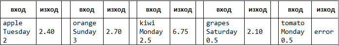

⦁	Магазин за плодове
Магазин за плодове през работните дни работи на следните цени:
 
<table>
<thead><tr><th>плод</th><th>banana</th><th>apple</th><th>orange</th><th>grapefruit</th><th>kiwi</th><th>pineapple</th><th>grapes</th></tr></thead><tbody>
 <tr><td>цена</td><td>2.50</td><td>1.20</td><td>0.85</td><td>1.45</td><td>2.70</td><td>5.50</td><td>3.85</td></tr>
</tbody></table>
 
В събота и неделя магазинът работи на по-високи цени:
 
<table>
<thead><tr><th>плод</th><th>banana</th><th>apple</th><th>orange</th><th>grapefruit</th><th>kiwi</th><th>pineapple</th><th>grapes</th></tr></thead><tbody>
 <tr><td>цена</td><td>2.70</td><td>1.25</td><td>0.90</td><td>1.60</td><td>3.00</td><td>5.60</td><td>4.20</td></tr>
</tbody></table>
 
Напишете програма, която чете плод (banana / apple / orange / grapefruit / kiwi / pineapple / grapes), ден от седмицата (Monday / Tuesday / Wednesday / Thursday / Friday / Saturday / Sunday) и количество (число), въведени от потребителя като аргументи, и пресмята цената според цените от таблиците по-горе. Резултатът да се отпечата закръглен с 2 цифри след десетичната точка. При невалиден ден от седмицата или невалидно име на плод да се отпечата “error”. 
 
<b>Примерен вход и изход:</b>
 

